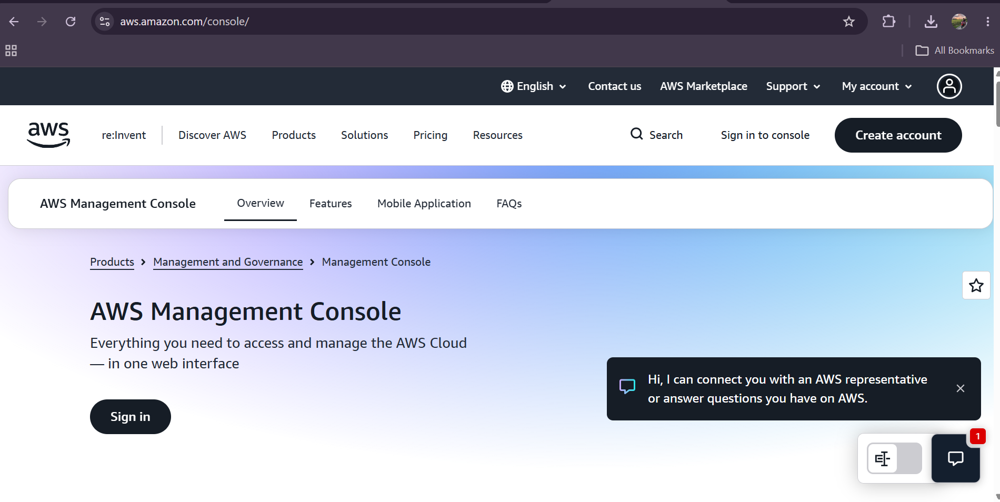

# Amazon Web Services (AWS)

## 1. Brief Overview

Amazon Web Services (AWS) is a cloud computing platform provided by Amazon. It offers many cloud services that organizations can use to build, deploy, store, and manage applications and data without having to maintain all physical infrastructure themselves.

## 2. Global Infrastructure

AWS has a global cloud infrastructure made up of Regions and Availability Zones. AWS Regions are separate geographic areas around the world, while Availability Zones are isolated locations within a Region. This infrastructure helps organizations deploy applications closer to their users and improve availability and reliability.

## 3. Cloud Management Console

The AWS Management Console is a web-based interface used to access and manage AWS services. Users can create and configure resources, monitor services, manage security, and control their cloud infrastructure through the console.

## 4. Four Core Services

### 1. Amazon EC2

Amazon Elastic Compute Cloud (Amazon EC2) provides virtual servers that can be used to run applications and workloads in the cloud.

### 2. Amazon S3

Amazon Simple Storage Service (Amazon S3) is an object storage service used to store and retrieve files, data, backups, and other digital objects.

### 3. Amazon VPC

Amazon Virtual Private Cloud (Amazon VPC) allows users to create a logically isolated network in AWS where they can control networking and communication between cloud resources.

### 4. AWS IAM

AWS Identity and Access Management (IAM) allows organizations to manage users, roles, permissions, and access to AWS resources.

## 5. Three Advantages

1. **Scalability** – AWS allows organizations to increase or decrease cloud resources based on their workload and demand.

2. **Global Availability** – AWS provides infrastructure in different geographic locations, allowing applications to serve users around the world.

3. **Wide Range of Services** – AWS provides many services for computing, storage, networking, databases, security, analytics, and other cloud requirements.

## 6. Typical Enterprise Use Cases

AWS can be used by enterprises for hosting websites and applications, storing and backing up large amounts of data, running databases, developing software, analyzing data, and deploying scalable business applications.

## Screenshot

