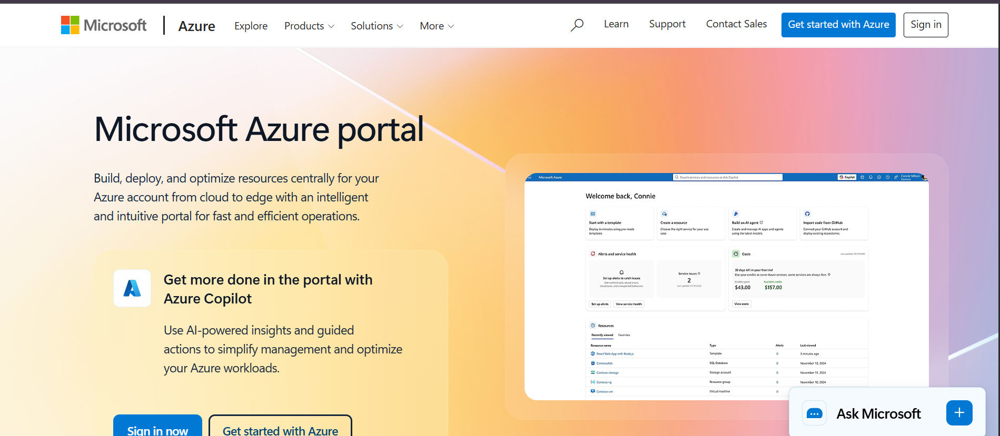

# Microsoft Azure

## 1. Brief Overview

Microsoft Azure is a cloud computing platform developed by Microsoft. It provides cloud services that organizations can use to build, deploy, manage, and store applications and data through Microsoft's global cloud infrastructure.

## 2. Global Infrastructure

Azure has a global infrastructure consisting of regions and availability zones. Azure regions are geographic locations that contain cloud datacenters, while availability zones are physically separate locations within supported regions. This infrastructure helps organizations improve application availability, reliability, and performance.

## 3. Cloud Management Console

The Azure Portal is a web-based management interface used to create, configure, monitor, and manage Azure resources. Users can manage services such as virtual machines, storage, databases, networking, and security through the portal.

## 4. Four Core Services

### 1. Azure Virtual Machines

Azure Virtual Machines provide scalable virtual computers that allow organizations to run applications and operating systems in the cloud.

### 2. Azure Blob Storage

Azure Blob Storage is an object storage service designed to store large amounts of unstructured data such as documents, images, videos, and backups.

### 3. Azure Virtual Network

Azure Virtual Network allows Azure resources to communicate with each other and provides networking capabilities such as private networks, subnets, and network security.

### 4. Microsoft Entra ID

Microsoft Entra ID is Microsoft's cloud-based identity and access management service. It helps organizations manage users and control access to applications and cloud resources.

## 5. Three Advantages

1. **Microsoft Integration** – Azure works well with Microsoft products and technologies such as Windows Server, Microsoft 365, and Active Directory.

2. **Scalability** – Azure allows organizations to scale computing and other cloud resources according to their business requirements.

3. **Global Infrastructure** – Azure provides cloud infrastructure across many geographic regions, helping organizations deploy applications closer to their users.

## 6. Typical Enterprise Use Cases

Azure is commonly used by enterprises for hosting business applications, migrating Windows Server workloads, managing databases, storing data, developing applications, implementing identity management, and integrating existing Microsoft technologies with cloud services.

## Screenshot

