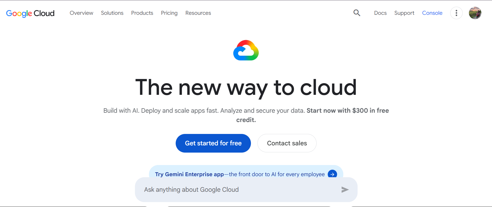

# Google Cloud Platform (GCP)

## 1. Brief Overview

Google Cloud Platform (GCP) is a cloud computing platform provided by Google. It offers cloud services that organizations can use to build, deploy, manage, and scale applications, store data, and run computing workloads.

## 2. Global Infrastructure

Google Cloud has a global infrastructure made up of regions and zones. Regions are geographic locations where Google Cloud resources can be deployed, while zones are locations within a region. This infrastructure helps organizations improve application performance, availability, and reliability.

## 3. Cloud Management Console

The Google Cloud Console is a web-based interface used to manage Google Cloud resources and services. Users can create and manage virtual machines, storage, networks, databases, and other cloud resources through the console.

## 4. Four Core Services

### 1. Compute Engine

Compute Engine provides virtual machines that organizations can use to run applications and workloads in Google's cloud infrastructure.

### 2. Cloud Storage

Cloud Storage is an object storage service used to store and retrieve files, backups, media, and other types of data.

### 3. Virtual Private Cloud (VPC)

Google Cloud VPC provides networking capabilities for connecting and managing cloud resources. It allows organizations to configure networks, subnets, routes, and security controls.

### 4. Cloud Identity

Cloud Identity provides identity and access management capabilities that help organizations manage users and control access to applications and cloud resources.

## 5. Three Advantages

1. **Strong AI and Machine Learning Capabilities** – Google Cloud provides services and infrastructure that support artificial intelligence and machine learning workloads.

2. **Scalable Infrastructure** – GCP allows organizations to scale their computing and cloud resources according to their workloads.

3. **Global Infrastructure** – Google Cloud provides infrastructure in multiple regions and zones around the world, helping organizations deploy applications globally.

## 6. Typical Enterprise Use Cases

Google Cloud can be used by enterprises for hosting applications and websites, storing and analyzing large amounts of data, developing artificial intelligence and machine learning applications, running virtual machines, and deploying containerized applications using Kubernetes.

## Screenshot

