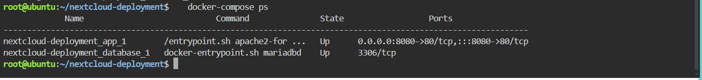
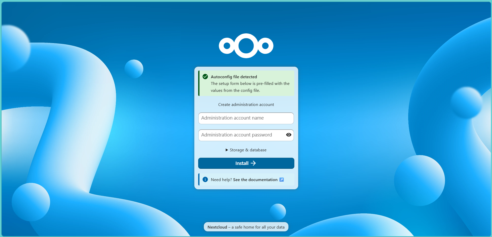
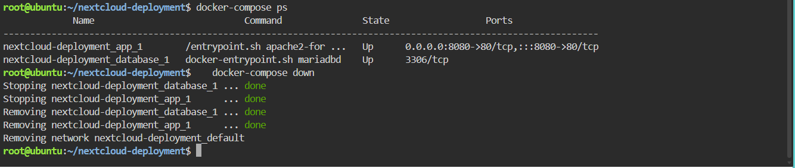

# Laboratory 06 - The Cloud Deployment Engineer

## Mission Overview

In this mission I acted as a Cloud Deployment Engineer at CloudNova Technologies. The task was to deploy a proof-of-concept private cloud storage system for a university using **Nextcloud** and **MariaDB**. Instead of starting containers one by one with `docker run`, I wrote a `docker-compose.yml` file (Infrastructure as Code) and deployed the whole two-tier stack with a single command in a KillerCoda Ubuntu Playground.

## Objectives

- Explain the concept of a multi-tier application architecture.
- Understand the purpose and structure of a `docker-compose.yml` file.
- Use the Linux command-line text editor (nano) to create configuration files.
- Deploy a multi-container application (Nextcloud + database) using Docker Compose.
- Document deployment procedures and IaC principles using Markdown.
- Continue expanding my GitHub Cloud Computing Portfolio.

## Commands Executed

```bash
mkdir nextcloud-deployment        # create a project directory
cd nextcloud-deployment           # move into it
nano docker-compose.yml           # create the Compose file
docker-compose up -d              # deploy the stack in the background
docker-compose ps                 # verify both containers are running
docker-compose down               # stop and remove the whole stack
```

## Screenshots

| Evidence | File |
|---|---|
| Successful deployment and running containers | `screenshots/compose-deployment.png` |
| Nextcloud installation page in the browser | `screenshots/nextcloud-web.png` |
| Containers stopped and removed | `screenshots/compose-teardown.png` |





## Skills Learned

- Explaining a two-tier (web + database) architecture
- Writing a valid, space-sensitive YAML configuration file
- Creating and editing files with nano
- Deploying and tearing down a multi-container stack with Docker Compose
- Connecting containers using service names and environment variables
- Publishing a container port and accessing the app in a browser
- Documenting infrastructure with Markdown and managing it in GitHub

## Documentation

- [Multi-Tier Architecture](multi-tier-architecture.md)
- [Docker Compose Guide](docker-compose-guide.md)
- [Reflection](reflection.md)
